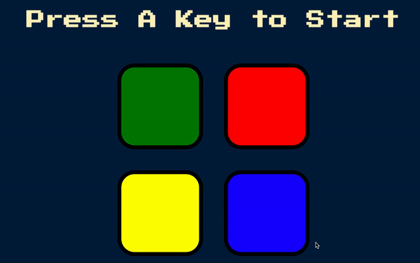

# Simon-Game

Simon Game is a memory skill game where the player is given a random sequence of patterns and must repeat the pattern back to the computer. 
I built this project using JavaScript for the game functionality and HTML and CSS for the frontend user interface. The user can start the game by clicking any key on the keyboard. Once the player is makes a mistake repeating the pattern the game ends.

